## 1，nmap和dirsearch

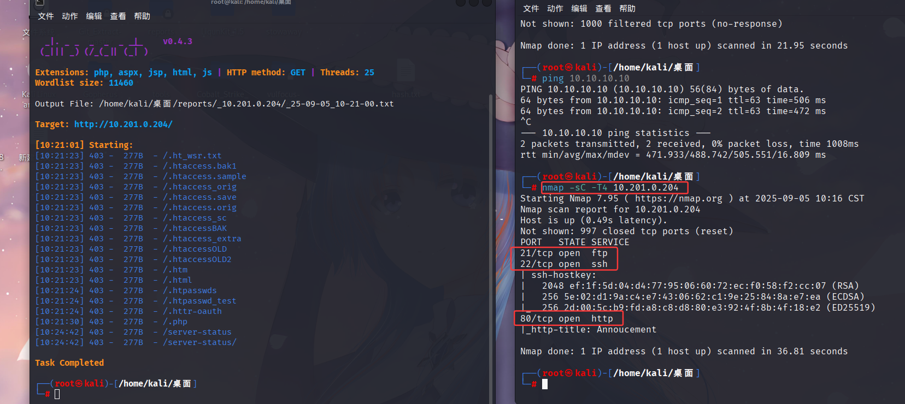

如上图所示，nmap发现三个端口，dirsearch没发现什么有意思的内容

## 2，进行测试

访问网页，发现一段话，告诉我们可以更改UA头

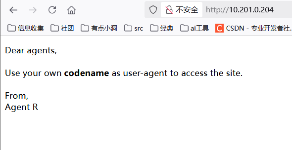

抓包，然后将UA头改为R试试

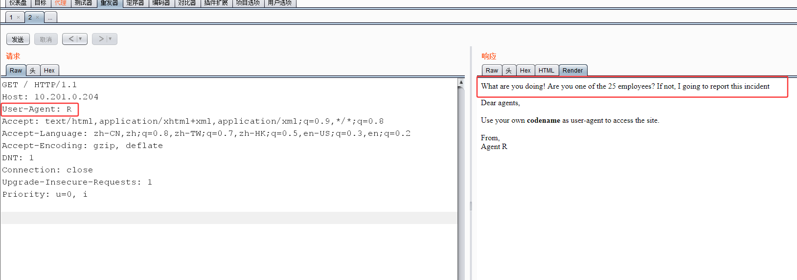

这句话的意思是我们不在25个成员以内，根据R这个名字，试试`A-Z`进行爆破，然后发现C的数据包有差异

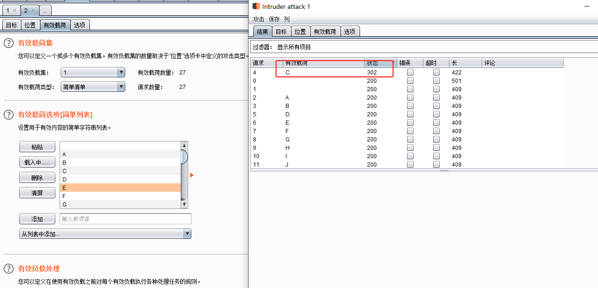
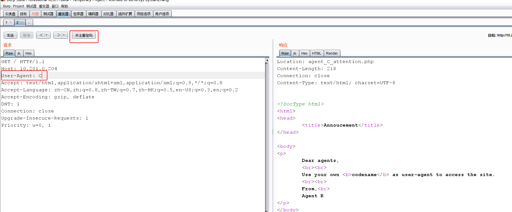

重定向到新页面

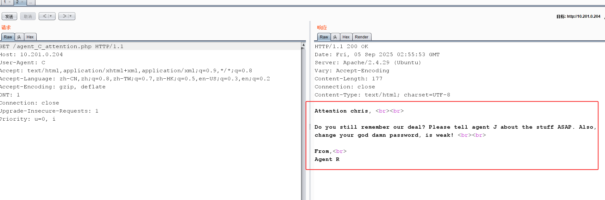

告诉我们密码太弱，根据nmap发现的ftp端口信息，使用hydra进行爆破

    方法：
    hydra -l <用户名> -P <密码字典路径> <目标IP> <协议>
    hydra -L <用户名字典路径> -p <密码> <目标IP> <协议>

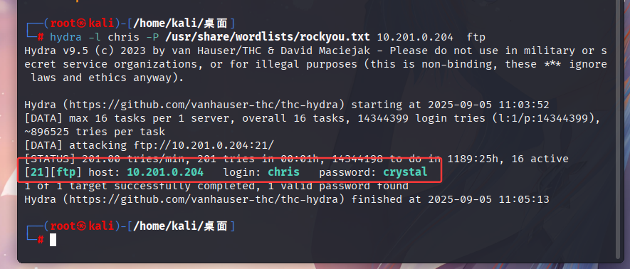

登录查看，发现三个文件，全部get下来瞧瞧

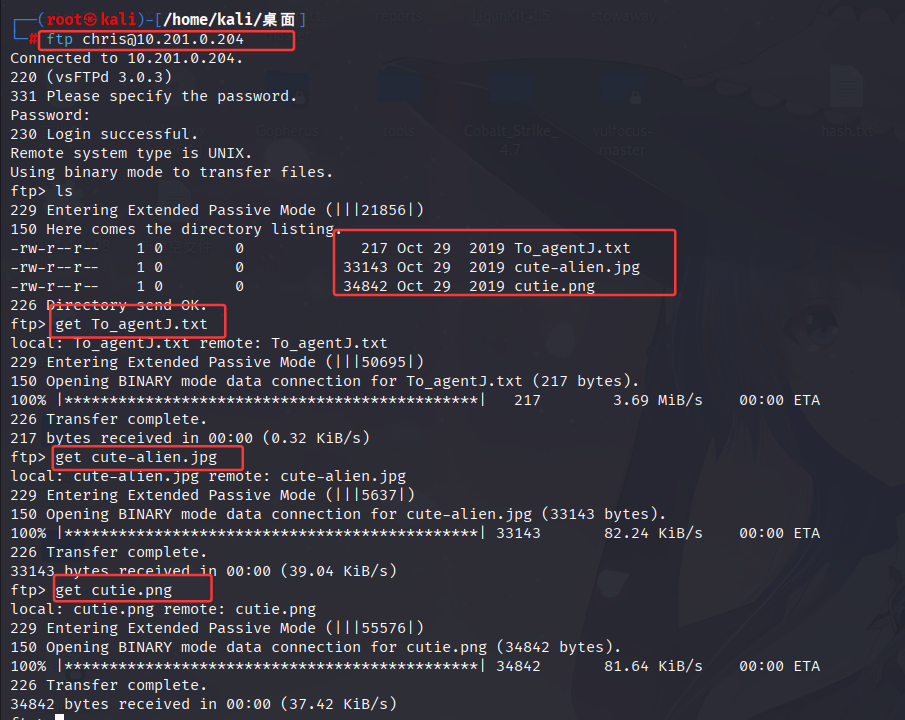

查看txt文件，大概意思是

    所有这些外星人的照片都是假的！R探员在你的目录里保存了真实的照片。你的登录密码不知何故存储在假图片里。对你来说应该不成问题。

使用`binwalk`工具对图片进行分析

    binwalk 通常用于对固件映像或其他类型的二进制文件进行逆向工程，以发现隐藏或编码的数据，例如引导加载程序、内核映像或文件系统。

`binwalk sutie.png` 该命令发现了一个zip文件
`binwalk -e --run-as=root cutie.png` 使用该命令对这个zip文件进行分析

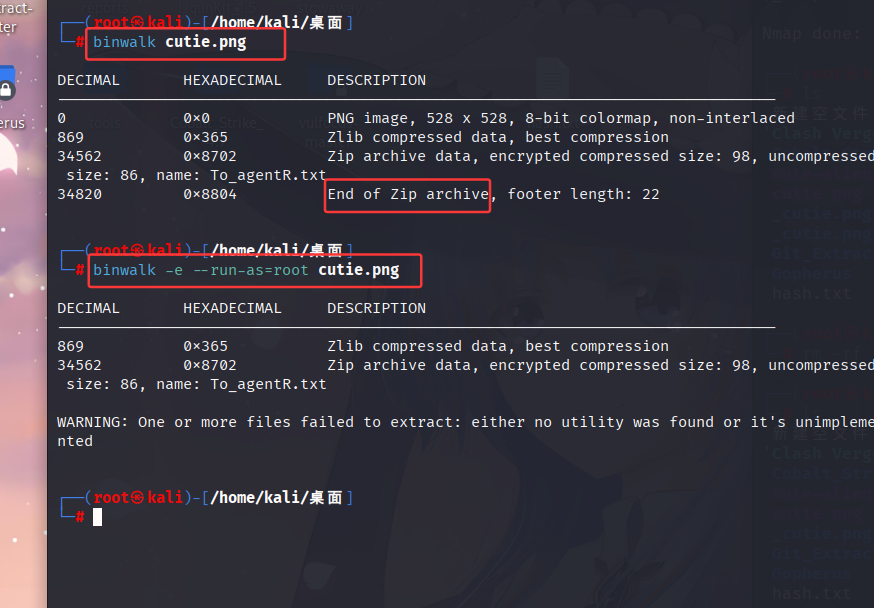

然后发现这个文件需要密码，于是使用 John the Ripper。John 还有另一个名为 zip2john 的实用程序。zip2john 可以帮助我们从 zip 文件中获取哈希值   

    John the Ripper用于检测和提升密码安全性。它主要通过各种 破解模式（字典、暴力、混合规则等）来尝试恢复密码

密码破解后打开压缩文件

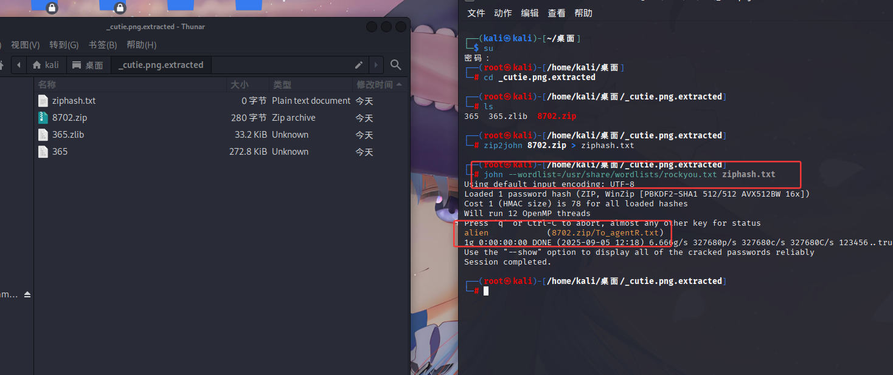

有了密码以后，解压文件并读取发现一串新的编码，通过base64解码（os：不知道什么编码可以询问ai，很简单的编码）

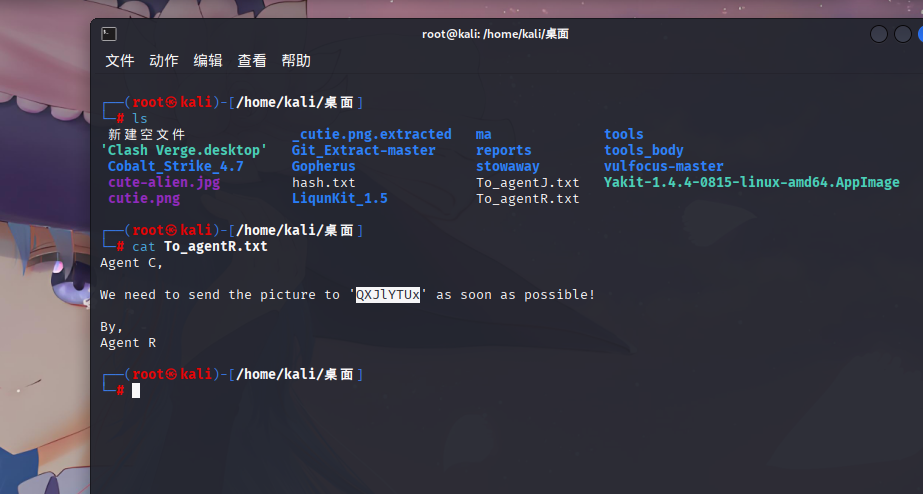

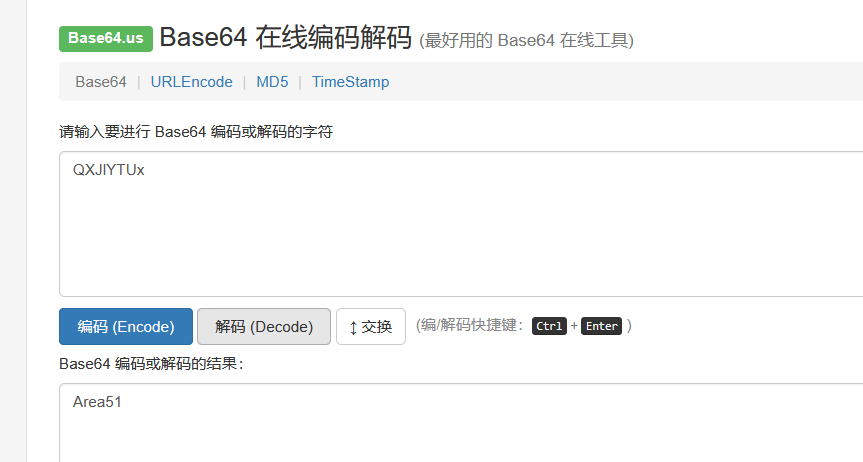

解码完成以后，可以发现，我们现在似乎没用到的信息就只剩下另外一张图，这里我们需要用到一款新工具（steghide）

    Steghide 是一个经典的开源隐写术（Steganography）工具，用于 在图片或音频文件中嵌入或提取隐藏数据。它支持 BMP、JPEG、WAV、AU 等格式，并可以通过密码保护隐藏的数据。kali自行下载（apt-get install steghide）

分析`cute-client.jpg`以后得到`message.txt`文件
打开，发现james的登陆密码（os：这道题，感叹号也是密码）

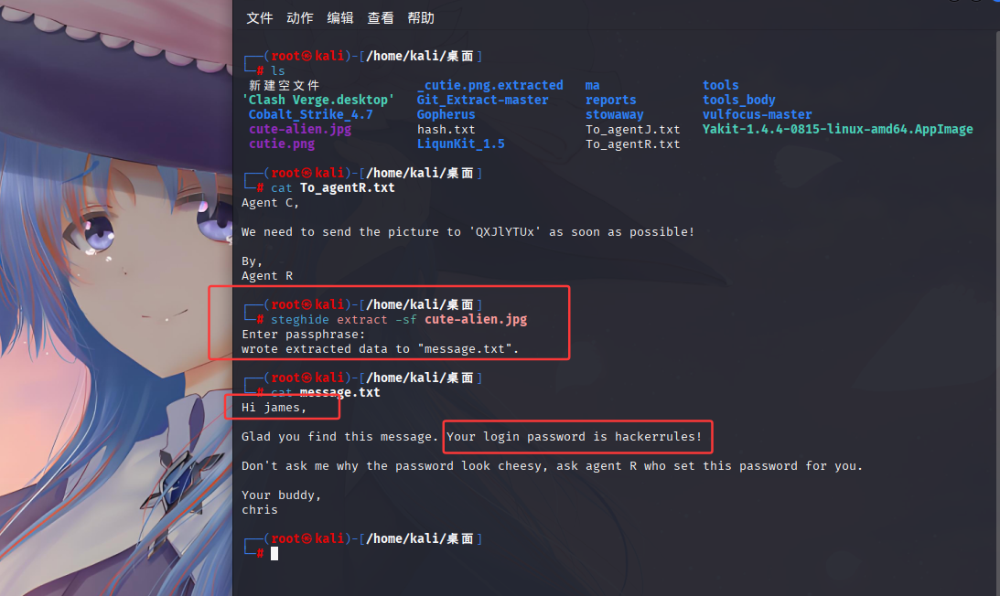

ssh服务链接上以后，得到flag跟另外一张图片，scp下载到本地（`scp james@10.201.110.130:/home/james/Alien_autospy.jpg /home/kali/桌面 `）
该图片经过询问ai，知道了这是罗斯威尔事件

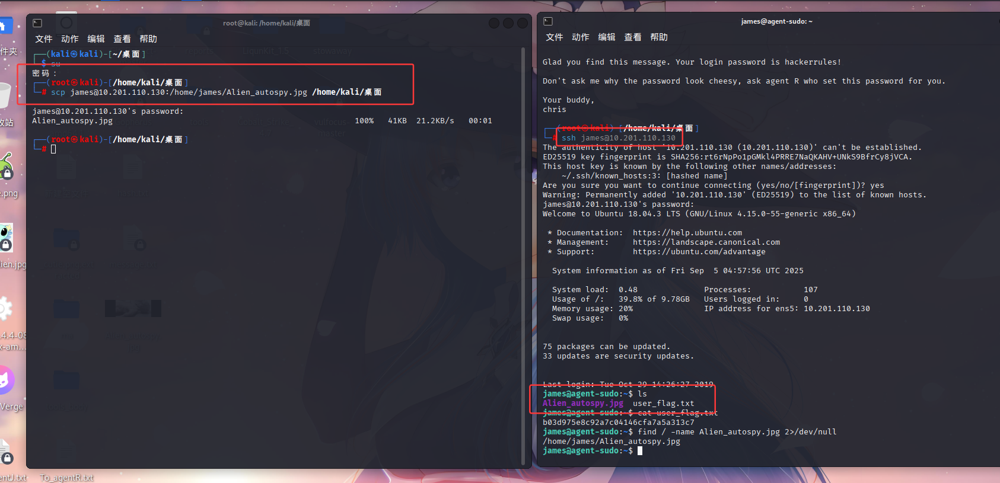

## 3，提权

这一步确实难住我了，google了一下wp以后，发现这是一个`cve-2019-14287`

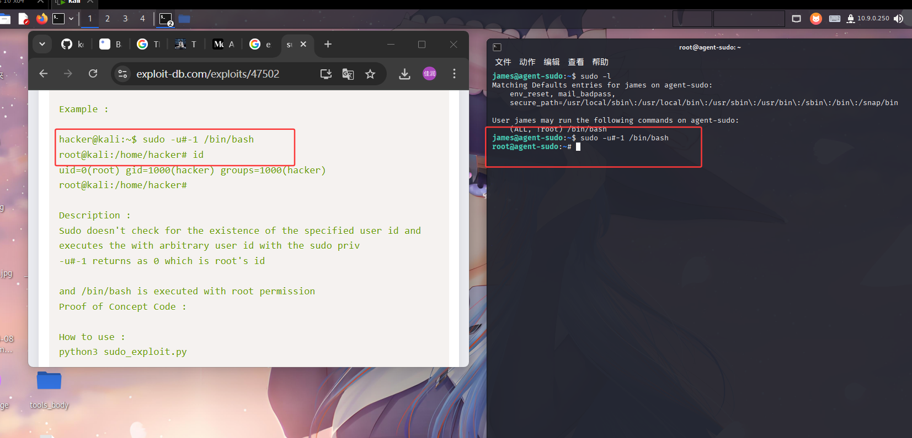

得到root权限，题目询问root flag，我们就到root目录下查看，然后得到答案

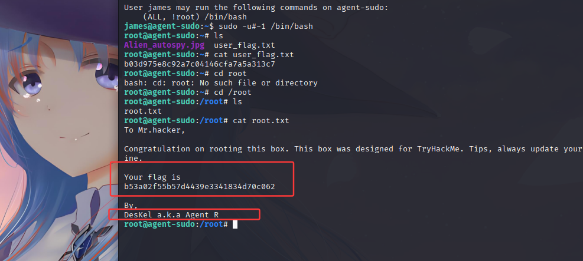

## 4，总结

    工具总结：
    hydra--用于对各种服务进行暴力破解（Brute-force）或字典攻击（Dictionary attack）
    binwalk--用于对固件映像或其他类型的二进制文件进行逆向工程，以发现隐藏或编码的数据，例如引导加载程序、内核映像或文件系统
    John the Ripper--用于检测和提升密码安全性。它主要通过各种 破解模式（字典、暴力、混合规则等）来尝试恢复密码
    Steghide--用于 在图片或音频文件中嵌入或提取隐藏数据。它支持 BMP、JPEG、WAV、AU 等格式，并可以通过密码保护隐藏的数据。

    参考文章：https://medium.com/@k.ereksonas/agent-sudo-writeup-thm-a1e9bb56183a