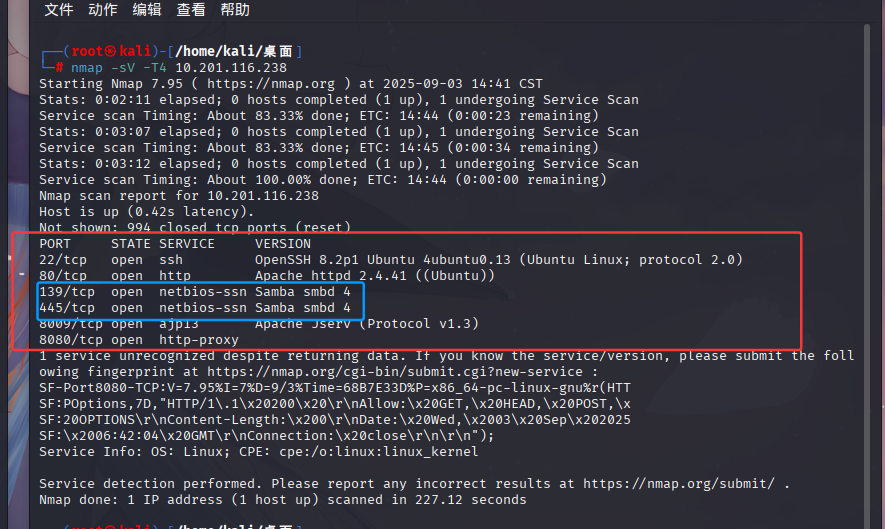
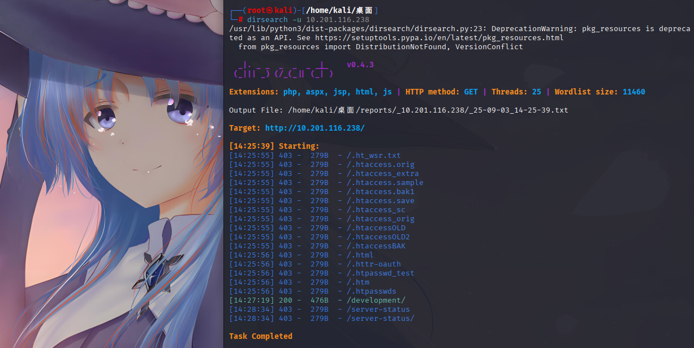
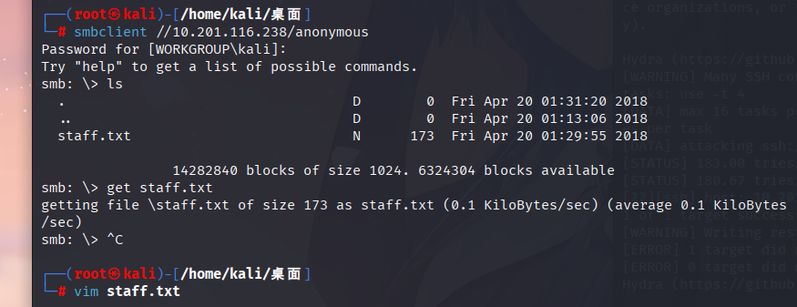
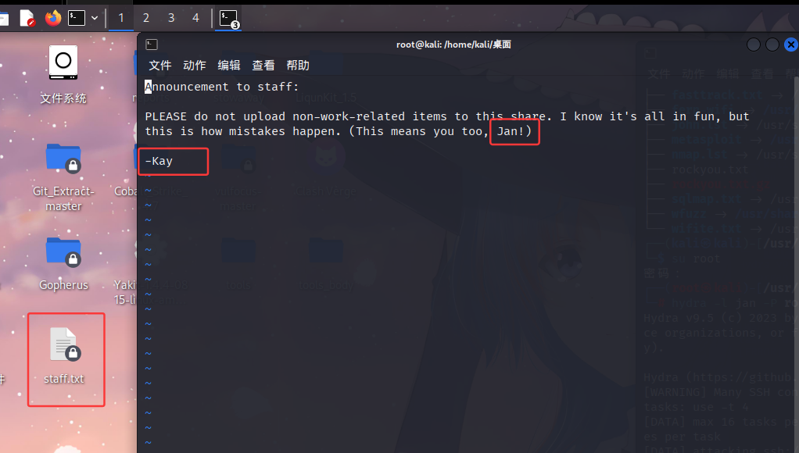
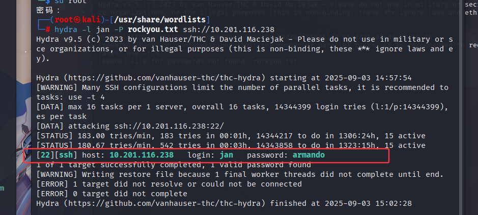
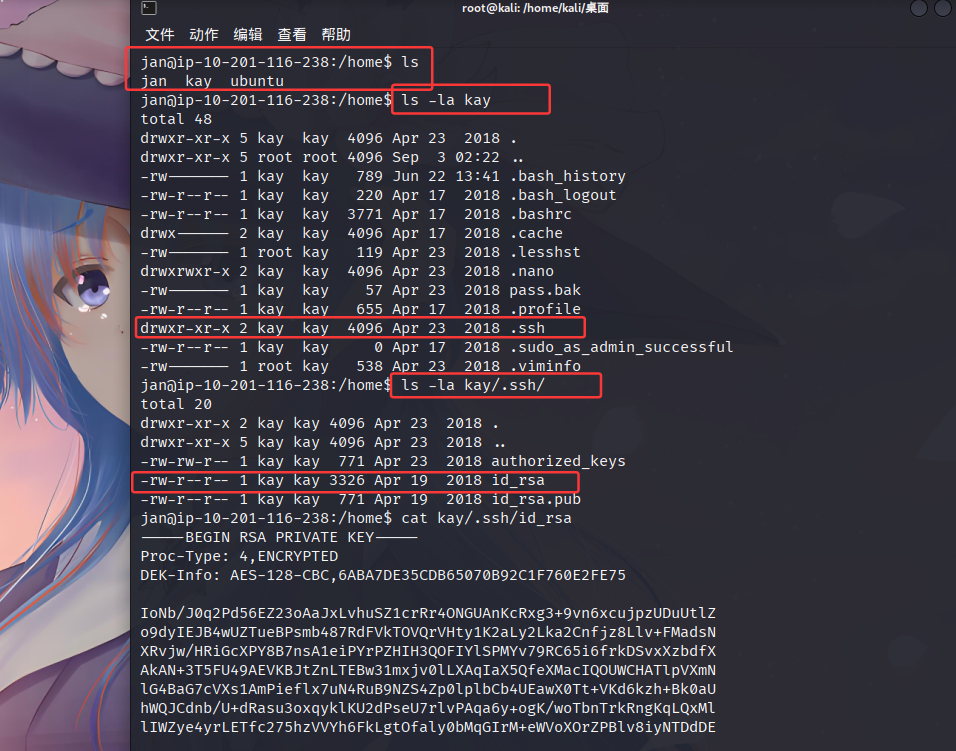
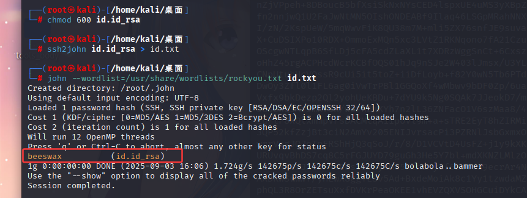
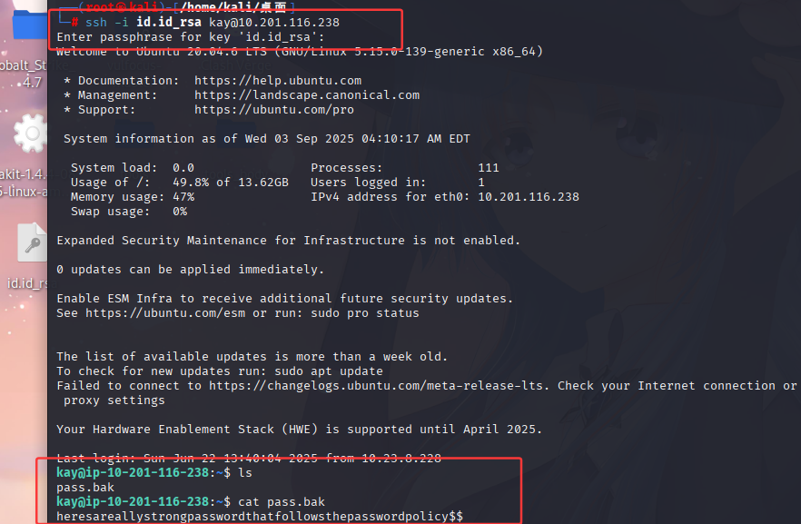

## 1，nmap扫描端口

根据结果我们可以发现具有Samba服务，可以使用enum4linux来进行爆破

## 2，dirsearch扫描文件

## 3，获取用户名（使用enum4linux）

### enum4linux工具介绍
enum4linux 是一个kali自带的用于枚举（收集）来自 Windows 和 Samba 系统信息的渗透测试工具，特别是在一个本地网络环境中。它本质上是一个 Perl 脚本，自动化了大量用于从 SMB（服务器消息块）服务中提取信息的命令。（os：详细的介绍还请自行搜索）

如上所述，使用该工具是可以爆破的（os：因为要等太久，所以我决定自己上）

根据nmap的扫描结果，我们知道靶机运行了Samba服务（使用smbclient）

smbclient 是一个类似于 FTP 客户端的命令行工具，允许你与 Windows 共享（或提供 SMB 协议的其他设备，如 Samba 服务器）进行交互，包括浏览、上传、下载和删除文件。（os：详细的介绍还请自行搜索）

下载文件，查看文件，得到用户名

## 4，密码爆破（使用hydra）

使用案例：

hydra -l <用户名> -P <密码字典路径> <目标IP> <协议>
hydra -L <用户名字典路径> -p <密码> <目标IP> <协议>

如上图所示，密码已经被爆破出来了（os：非常不建议使用，字典太大了，rockyou.txt是kali自带的字典，在usr/share/wordlists目录下）

## 4，ssh链接

得到其他用户的id_rsa
使用kali自带的john解密工具进行解密

`ssh2john id.id_rsa > id.txt`
将 SSH 私钥的密码哈希转换并提取出来，保存到一个新文件 id.txt 中

`john --wordlist=/usr/share/wordlists/rockyou.txt id.txt`
使用字典攻击的方式，尝试破解哈希文件中的密码。

密码就是beeswax，登陆后查看就可以解答完这道题的最后一问

