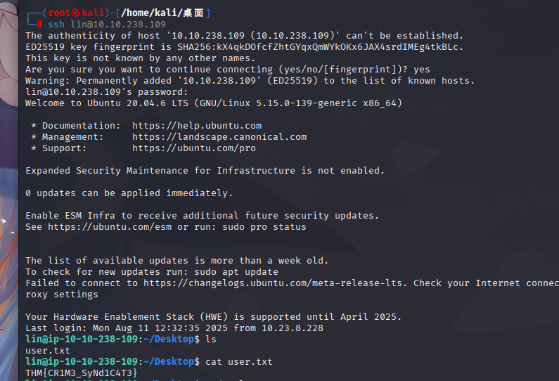

## 1，nmap及基础测试

nmap扫描结果，发现ftp，ssh（这里的思路是看看门户网站有没有信息）
然后发现并没有什么可利用的信息

那就不管了，尝试ftp登陆

530信息说的是这个ftp服务只能匿名登陆，使用anonymous作为name
登陆成功后，查看文件，看到俩文件，全部get下来
得到task任务发布的人

看另外一个文件
这个文件一看就像是什么密码，nmap还扫描出来了ssh服务，猜想会不会是ssh的密码
使用hydra工具对ssh的密码进行爆破

爆破出密码以后ssh登陆，得到第一个flag

## 2，提权

这道题做到这一步，其实很简单了，`sudo -l`显示当前用户 能用 sudo 执行哪些命令。

    (root)/bin/tar

这是lin这个用户可以用 sudo 以 root 权限 执行 /bin/tar

### GTFOBins提权

这道题为什么很简单，因为tar 在 GTFOBins 上有现成的提权 payload：

    sudo tar -cf /dev/null /dev/null --checkpoint=1 --checkpoint-action=exec=/bin/sh

然后whoami查看权限，找到root.txt，问题解决

