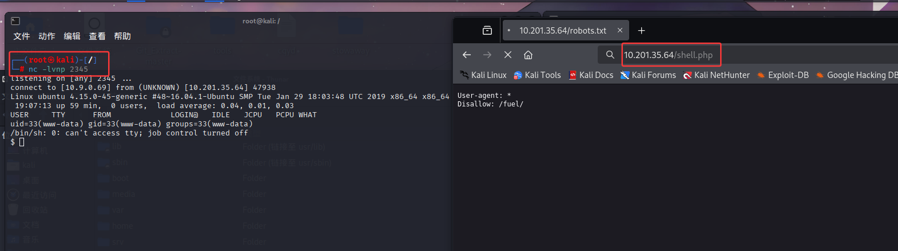

## 1，nmap+基础测试

nmap跟dirsearch的扫描结果如下，端口只开了80，目录也只有一些不重要的东西，robots.txt算有点用，告诉了我们`/fuel/`这个路径

查看80端口，能发现是一个CMS并且包含版本信息，因为目录没扫出有意义的东西，且端口只开了80
所以上exploit看看有没有历史漏洞

确实是存在历史问题的，这里我们使用exploit给的poc来进行攻击（这里我用的是`fuel CMS 1.4.1 - Remote Code Execution (1)`）
因为平台是linux，所以用这个poc（os：记得修改poc里面的url为靶机的url）

根据测试发现poc是能利用的，那么根据题目所说的找到`/home/www-data/flag.txt`

如上，就可以拿到第一个flag

## 2，wget提权姿势

因为我之前使用的几种提权手段在这里都失去了效果，所以我上网看了一些文章，知道了原来还可以通过wget的方式来获取反向shell

流程就是，将反向shell放在自己的攻击机上，然后在根目录开启http服务，通过wget将shell下载下来然后访问
（os：shell的下载位置在github上，PentestMonkey 的反向 shell）

监听shell里面的端口，成功连接

接下来就开始收集相关信息，其实我这里没有找到啥有用的信息，然后实在是没思路了，就看了看wp
说在`/var/www/html/fuel/application/config`里面存在一个数据库文件

得到密码以后，就可以拿到root了，不过因为这个shell他并不是交互式的shell，所以我们还需要升级shell

使用`python -c 'import pty; pty.spawn("/bin/bash")'`

    该命令的作用是在一个受限的 shell 环境中，生成一个伪终端 (PTY)，并把它绑定到 /bin/bash 上。

