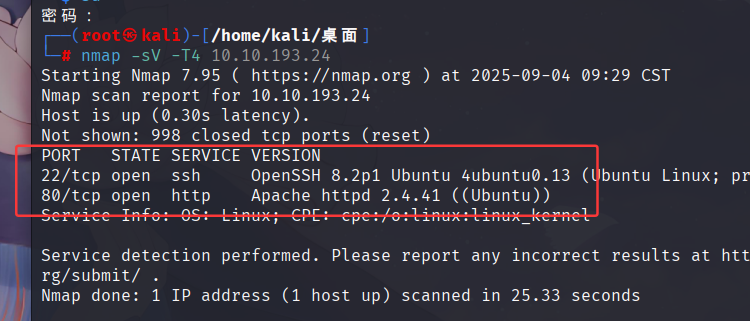
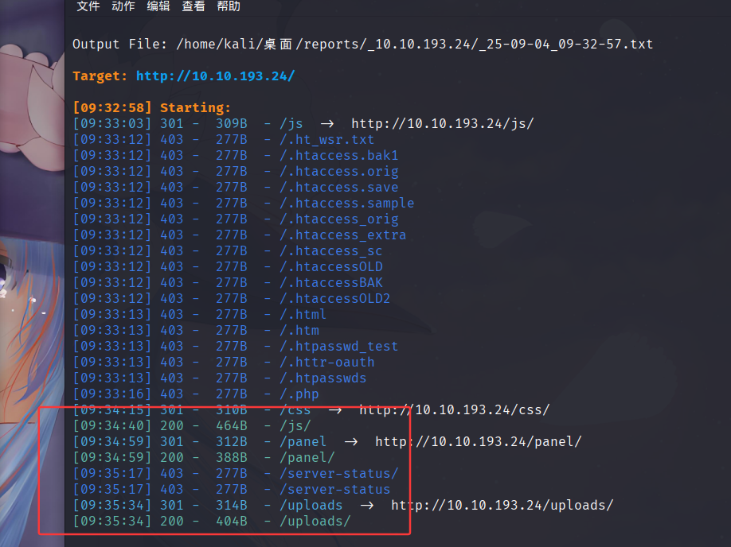
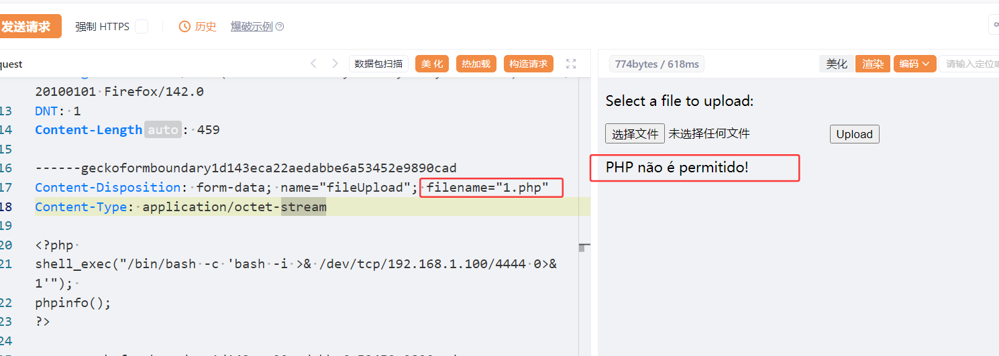
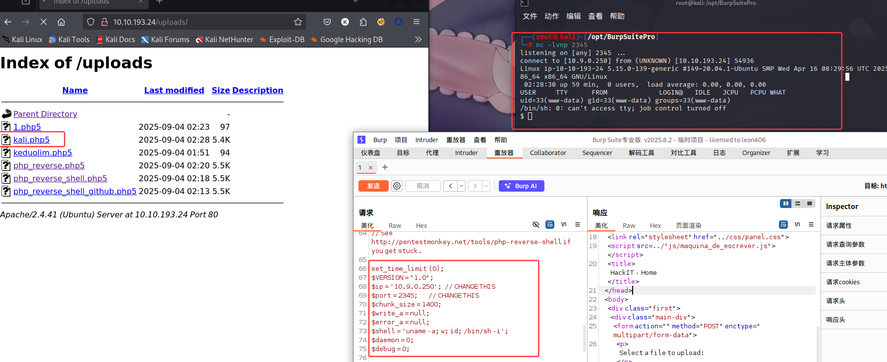
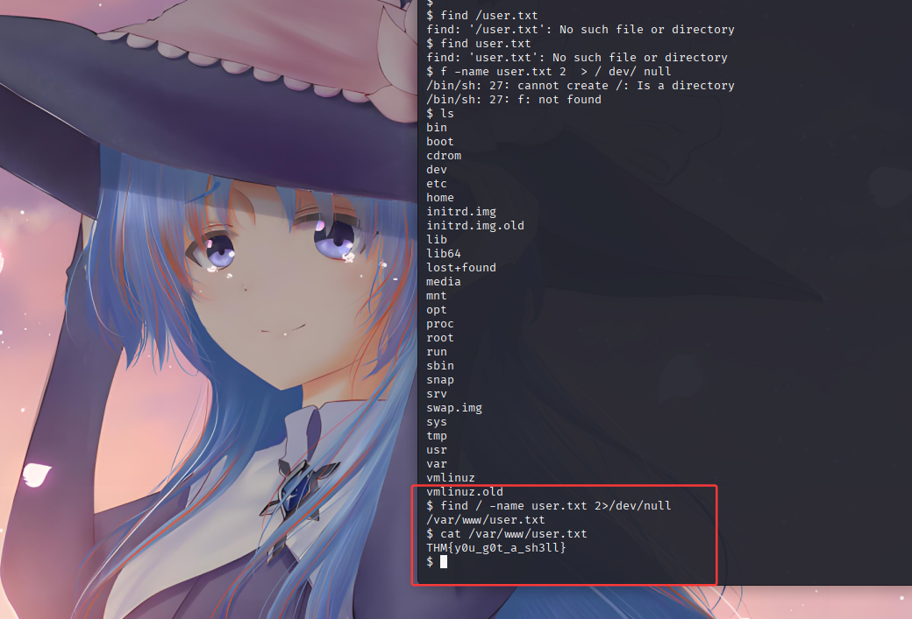
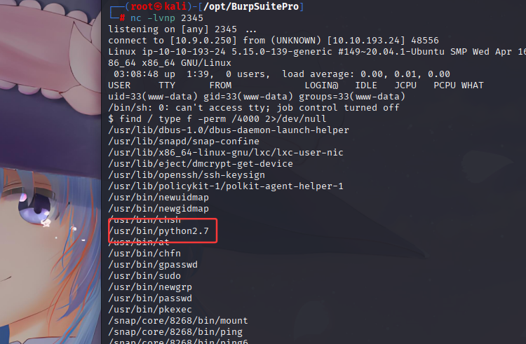
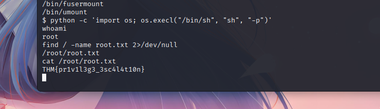

## 1，nmap跟dirsearch

如下图，端口22的ssh服务跟80的Apache

如下图，uploads跟panel路径（uploads是上传文件的存放点，panel是文件上传点）

## 2，文件上传

如下图，上传php文件会显示被过滤，所以我们将后缀改成php5即可

由于我的kali跟win10的openvpn的配置文件不同，所以我在kali上重新抓包并且修改了上传文件

上传成功后，浏览器访问你的上传文件，在kali监听端口，可以看到回连成功

`find / -name user.txt 2>/dev/null` 找到user.txt文件
读取该文件，得到flag

## 3，提权

`find / type f -perm /4000 2>/dev/null` 
这个命令主要用于 Linux 本地提权 (Privilege Escalation) 侦查。它的作用是查找系统中所有设置了 SUID 权限位的可执行文件。（os：我也卡住了，ai出来的）

### 破局点

如果它的权限变成了 -rwsr-xr-x（设置了SUID位），就意味着任何用户执行它时，它都会以root身份运行。

`python -c 'import os; os.execl("/bin/sh", "sh", "-p")'` 
该命令是启动一个具有更高权限的 shell，通常用于权限提升或维持访问。

## 4，总结
这道题主要可以拆解为两个板块，文件上传绕过以及提权
文件上传主要是考查基础以及反弹shell
提权主要是展示了`SUID`二进制文件中权限提升的潜力
