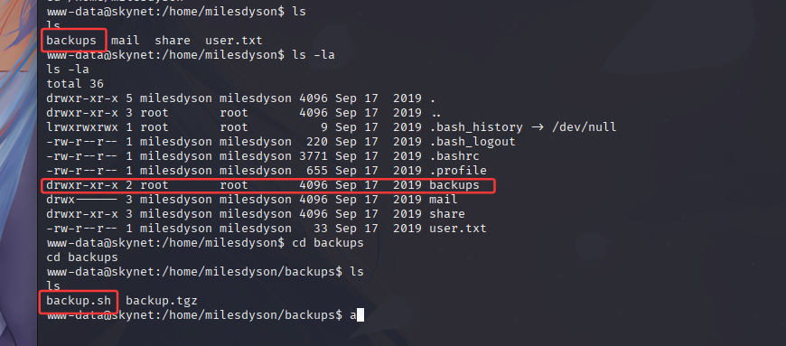

## 1，nmap+基础测试

根据nmap的扫描结果来看，靶机一共是开放了ssh，smb等服务，dirsearch的扫描结果等会再看
这里查看一下smb服务是否可以匿名登陆

`smbclient -L 10.201.104.72 -N `，使用该命令就可以判断是否smb是否允许匿名登陆
根据结果来看，smb是允许匿名登陆的，那我们就匿名登陆看看情况

匿名登录后，发现两个有内容的文件，get下来看看情况

log1.txt文件里面是一个像密码的文件，但我们目前还不知道啊这是什么的密码
attention.txt文件则是一段话，大概意思是说密码啥的都被修改了，这些都不是很重要，不过这里出现一个名字，milesdyson

根据扫目录得出的结果，可以发现有一个`/squirrelmail `路径，重定向后是一个登陆页面
用户名我们只有一个，密码我们也有一个疑似

尝试枚举看看能否登录（这里可以用bp抓包，我就直接展示结果了），记得username全小写

查看第一条邮件，说是smb密码重置，那看来就是milesdyson的个人smb密码了，试试看

登陆后，查看目录，发现note文件夹，剩下的都是pdf文件，在note里面，发现一个important.txt文件

在这个文件里有三条信息，其中比较重要的就是第一条信息，他给了一个路径说是`beta CMS`
网页浏览看看

既然这是一个新路径，那么dirsearch扫目录看看有没有什么线索
扫出来一个重定向页面，网页浏览是一个CMS页面

我们上`https://www.exploit-db.com/`看看有没有相关的内容，发现一个远程文件包含的漏洞

既然发现了现成的漏洞，我们就看看能否使用
`http://target/cuppa/alerts/alertConfigField.php?urlConfig=[FI]`
根据这个payload信息，我们尝试开启kali的http服务，监听反弹shell的端口，访问kali上的shell
反连成功

查目录，看信息，得到第一个flag

## 2，通配符提权

我们接着查看其他文件，发现在backups文件夹下面有一个脚本文件

详细查看了一下，发现我们其实并没有执行权限，然后看内容
说的是切换到`/var/www/html`然后使用 tar 将该目录的内容压缩到名为backup.tgz的存档中
然后将其存储在`/home/milesdyson/backups/`目录中

然后就是本片文章的重点，通过*通配符注入*这种方式来进行提权

具体操作

    1，创建一个脚本来将 SUID 位设置为 /bin/bash
    `echo -e '#!/bin/bash\nchmod +s /bin/bash' > /var/www/html/root_shell.sh`
    2，创建这两个文件--checkpoint-action=exec=sh root_shell.sh和--checkpoint=1
    `touch "/var/www/html/--checkpoint-action=exec=sh root_shell.sh"`
    `touch "/var/www/html/--checkpoint=1"`

接下来，我详细解释一下原理

    --checkpoint-action=ACTION--checkpoint[=Number]tar 命令有两个可用选项。
    --checkpoint[=Number]：每条记录显示进度消息（默认 10）
    --checkpoint-action=ACTION：在每个检查点执行 ACTION。在我们的例子中exec。
    exec=command：执行指定的命令。在本例中是“ sh root_shell.sh”
    因此，当 cronjob 在下一分钟执行时，它将把我们上面创建的两个文件作为选项而不是普通文件名，并使用 setuid 权限设置 /bin/bash。

对于通配符提权，我是全程看完了wp，所以这一块基本都是借鉴的wp，我的文章可能解释的不是很清楚，详情可以参考以下文章：

    https://olivierkonate.medium.com/skynet-tryhackme-writeup-a1101714b2a

然后拿到了root权限，就是得到第二个flag了

