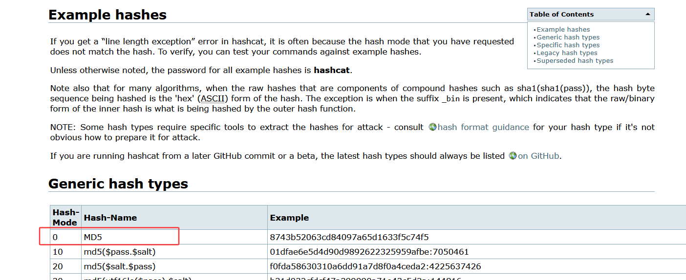

## 1，常规流程

    1、识别hash类型
    2、查找hashcat编号
    3、使用rockyou字典进行破解

## 2，实例

题目

工具的存放位置（os：若是有更改 `find / -name user.txt 2>/dev/null` 查询即可）

操作流程

1、识别hash类型

2、查找hashcat编号

`https://hashcat.net/wiki/doku.php?id=example_hashes`

3、使用rockyou字典进行破解

`hashcat -m 0 hash.txt /usr/share/wordlists/rockyou.txt` (os：记得将hash保存为txt文件进行破解)

后面的题目以此类推

## 3，参考文章

https://www.cnblogs.com/Hekeats-L/p/17206861.html