## 1,nmap+基础测试

如下图，nmap扫描出来了22跟80端口，dirsearch扫出来的有用就一个content目录

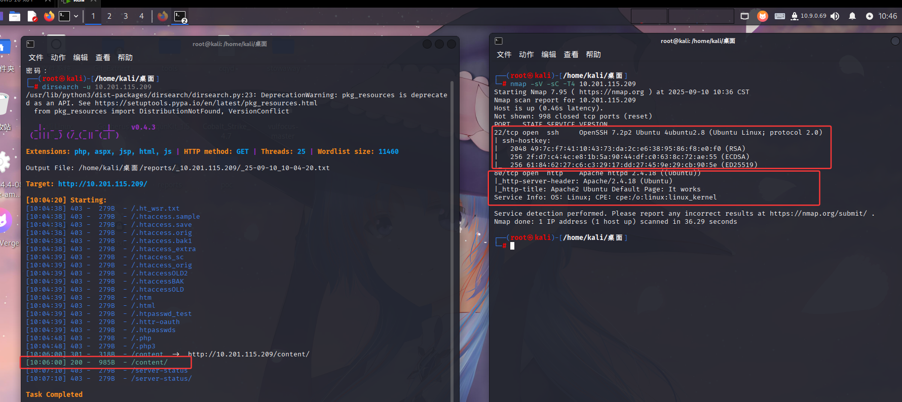

访问80端口，没发现什么东西，就是一个apache的页面

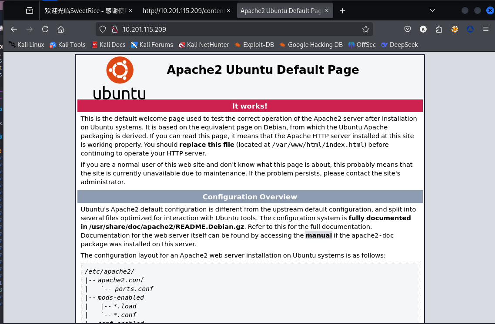

继续查看content目录，发现了这个网站是使用`SweetRice`这个框架，然后我对这个页面反复挖掘，并没有发现什么有用的信息

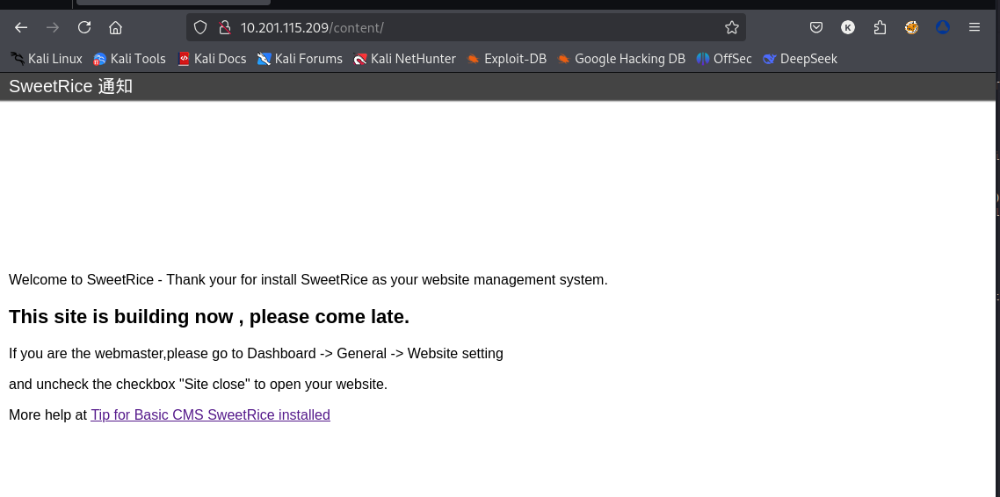

没招了，上exploit-db看看，这一看，果真发现一点消息

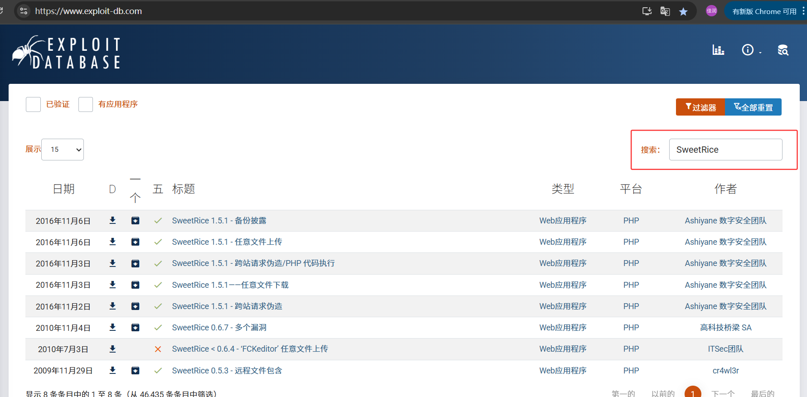

然后我就发现备份披露这里存在问题，但是要放在/content/后面（os：要问我怎么发现的，能用的就content目录，一个一个试，第一个就试出来了）

可以发现存在东西

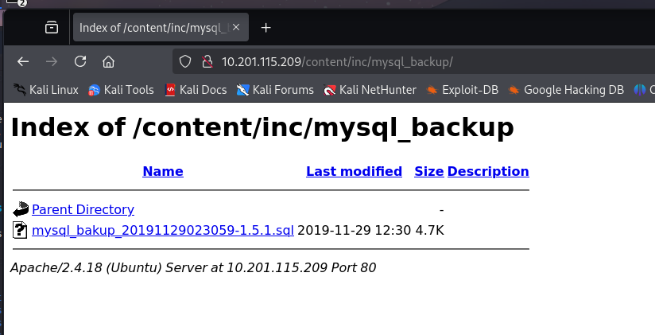

这里发现了明文的账号密码（os：ai真的是好东西，用来分析代码啥的效率太高了，不过也别依赖ai，因为ai经常会错，还是要自己过一遍）

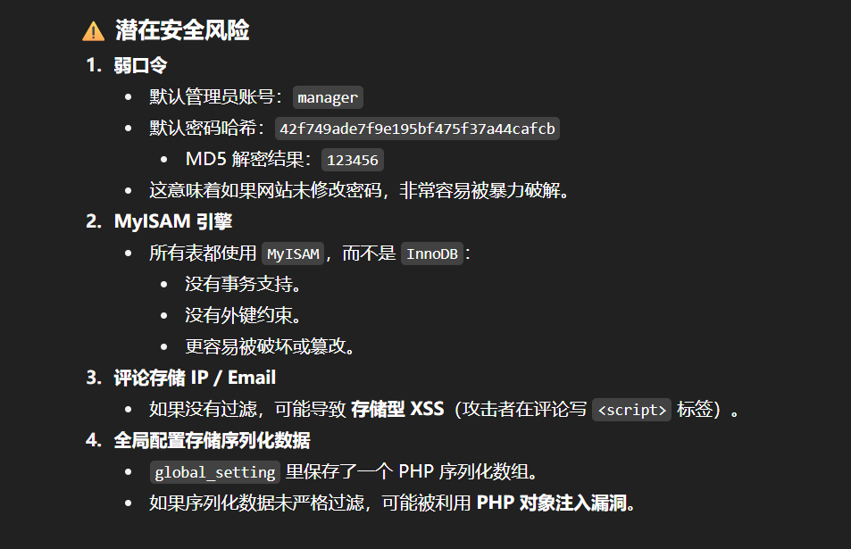
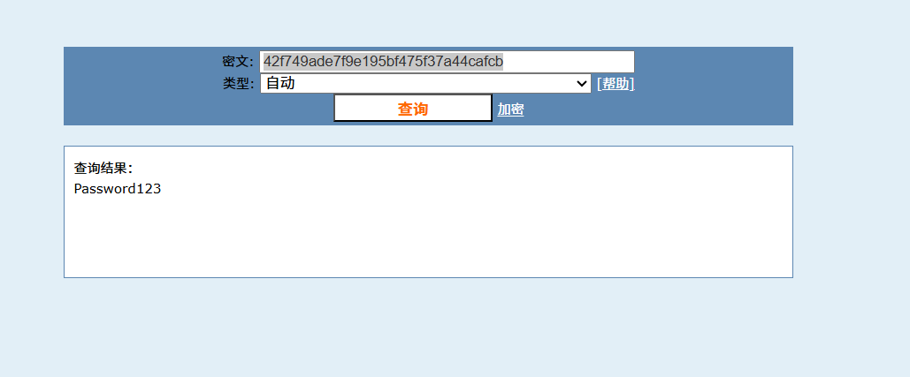

所以可以发现用户名是`manager`，密码是`Password123`

找到登陆入口（`http://127.0.0.1/content/as`），进入找到上传点

上传反弹shell，记得改后缀，避免过滤（shell的下载位置在github上，PentestMonkey 的反向 shell）
nc端口，反连成功后，就可以解决第一道题目

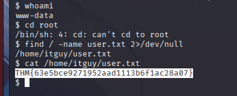

## 2，提权

查看sudo -l

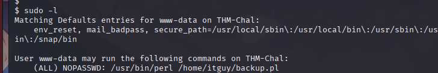

这个命令的意思是

    用户 www-data 可以用 sudo 来执行/usr/bin/perl /home/itguy/backup.pl
    (ALL) → 可以以任何用户身份执行（包括 root）。
    NOPASSWD → 执行时不需要输入密码

找到这个backup.pl文件，看权限发现只有root能修改，那就查看这个文件内容,这个文件其实执行的是`/etc/copy.sh`

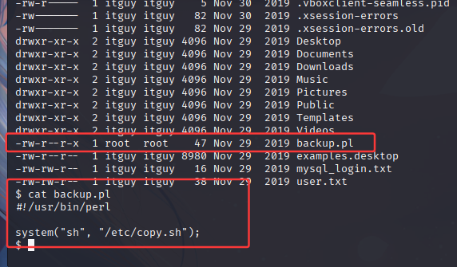

看这个copy.sh文件的权限，很简单了，root拥有者，其他用户(others)有rwx权限，所以 www-data 也能修改并执行这个脚本
那就写命令提权

写入`/bin/bash`到文件，然后以root身份执行就行了

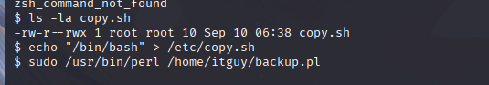

cd 到root目录，cat root.txt就可以得到答案

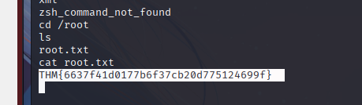

