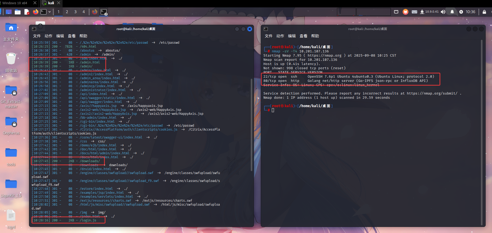
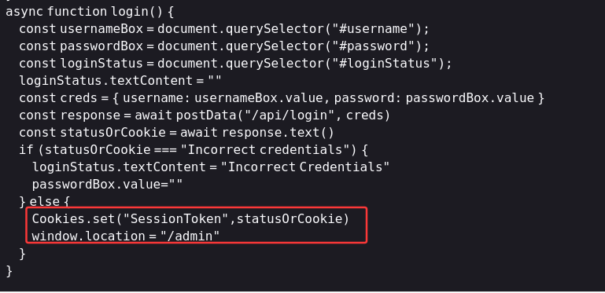
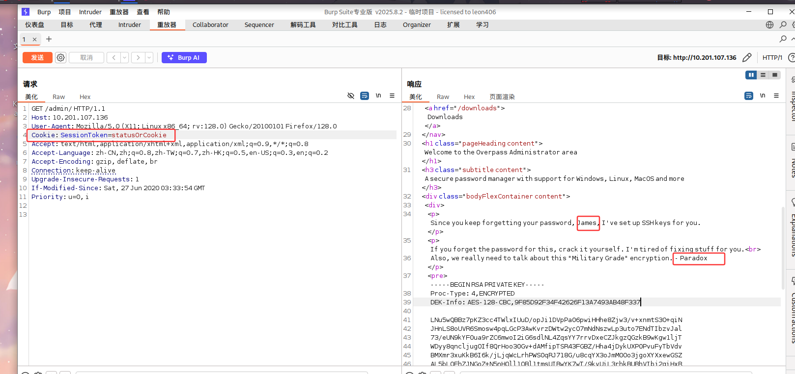
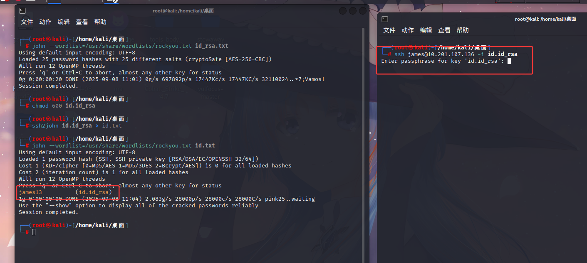
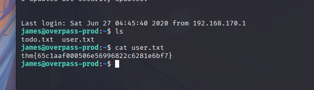
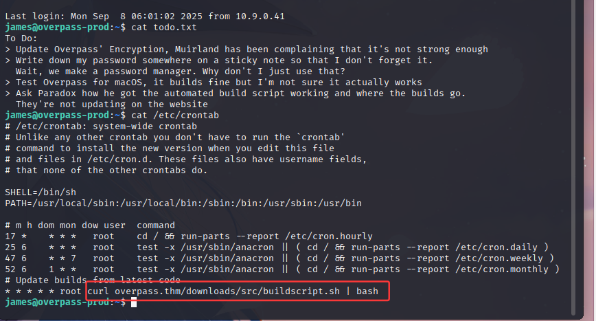
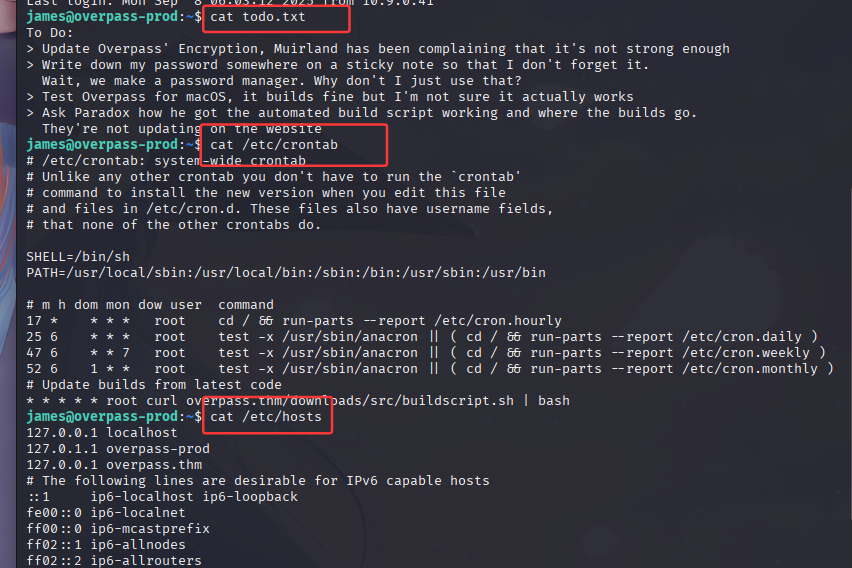
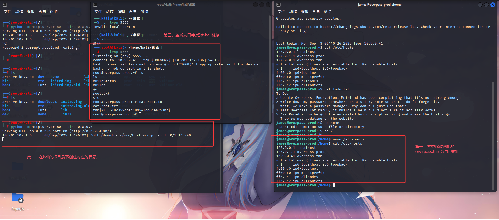
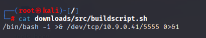

## 1，nmap和dir（os：感觉这一步以后不需要特意标明了）

如图所示，nmap发现80跟22端口，大概率要用到ssh服务了，dir扫出来的东西很多，一个下载页面，一个门户网站，一个登陆页面
登录页我尝试了弱口令，sql注入，字典爆破，收效甚微

## 2，开始测试

回过头看这几个js文件，login.js里的这句代码很重要
他说当我们的Cookie设置为 SessionToken=status0rCookie时，会跳转到admin路由

如下图，抓包修改cookie，这非常有效

发现了ssh的登陆私钥，两个人名（大概率用户名就是他俩），尝试登陆啥的发现需要密码，所以需要使用john工具爆破密码
（此事在本人的`Basic_Pentesting`亦有记载）

得到密码，登陆，看目录得到第一个flag

## 3，提权

查看todo.txt文件，告诉我们说他的密码很弱啊啥的（没招了，找找crontab，hosts啥的）
然后查看定时任务，看到他执行了一个curl命令，buildscript.sh文件
接下来看看hosts文件

看这个命令，curl执行的`用 curl 从 http://overpass.thm/downloads/src/buildscript.sh 下载脚本内容`

查看hosts

发现overpass.thm是指向的127.0.0.1，本机（这里我在想有啥用，然后看了一大堆wp发现基本是改hosts文件，我也没其他办法，就改）

这里面，第一步修改完以后就不用管了，定时任务会自己执行脚本
其实修改的就是`http://overpass.thm/downloads/src/buildscript.sh`里的 overpass.thm

第二部，需要在根目录下创建`downloads/src/buildscript.sh`这个目录，然后buildscript.sh放入反弹shell的脚本

需要在攻击机上执行`python -m http.server 80 --bind 0.0.0.0`
    这句话的作用是
    启动一个 临时 HTTP 文件服务器：
    python -m http.server → 启动 Python 内置的 HTTP 服务器，把当前目录作为网站根目录。
    80 → 指定监听端口为 80（默认是 8000）。
    --bind 0.0.0.0 → 绑定到所有网络接口（本机、局域网、VPN 上的机器都能访问）。

第三步就是监听你反弹shell的端口了

## 4， 总结

这道题其实对于工具的使用要求并不是很高，除了常规的nmap跟dirsearch使用就是john工具进行ssh的爆破，属于很常规的工具使用手段
更多的是考察思路，这道题的思考点有很多
    1，对于login.js文件的理解，能发现构建Cookie可以直接进admin就能解决第一问
    2，对于提权的常规理解，Suid提权，sudo -l提权啥的，这道题都用不了，但这道题提权的手段反而很简单
    理解定时任务的curl代码
    找到overpass.thm的含义
    修改hosts文件
    本机构建目录，写入反弹shell
    监听端口

这道题算是我目前遇到的最难的一道题，我也看了很多wp才想通为什么要这样做（os：还是思维不够开阔，看看02，舒缓心情）

