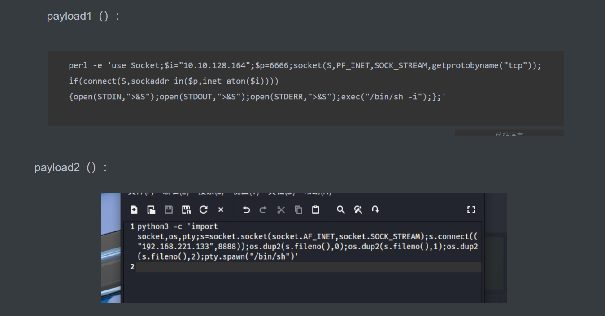
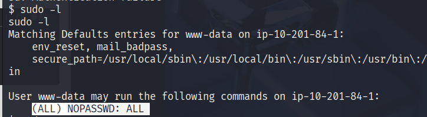

## 1，nmap扫描端口

## 2，dirsearch扫描文件

## 3，检查常见文件

​	robots.txt
​	查看源码

## 4，命令执行反弹shell

## 5，反弹shell成功后，检查权限跟提权

​	执行sudo -l		出现`(ALL) NOPASSWD: ALL`	

​		**ALL**（前面的括号）表示 `www-data` 可以以 **任何用户身份**执行命令（默认是 root）。

​		**NOPASSWD** 表示 **不需要输入密码**。

​		**ALL**（最后一个）表示 **可以执行任何命令**。

## 6，得到剩余材料

​		cd /home/rick

​		cd /root

​		剩余答案就在这里面